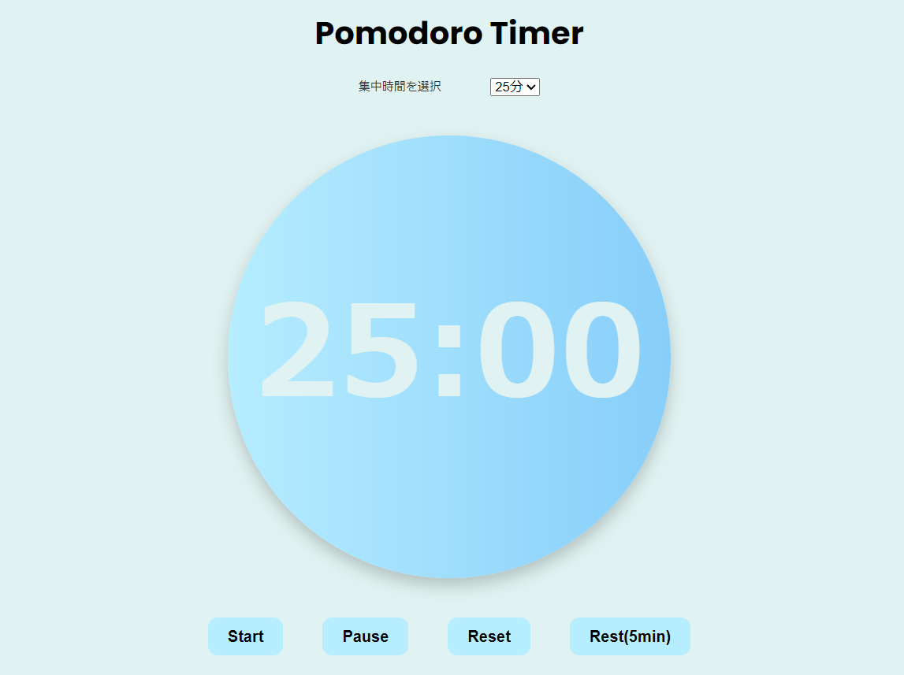

# ポモドーロタイマー

## 概要
集中力を高めるための「ポモドーロ・テクニック」を取り入れた学習・作業支援用タイマーアプリ

## 背景・目的
時間管理が苦手だった自分自身の課題を解決するために、シンプルかつカスタマイズ可能なタイマーを制作。
JavaScriptとphpの基礎を勉強し、このポートフォリオで実践し、技術を身に付けることを目的とする。

## 使用技術
- HTML
- CSS
- JavaScript
- php(予定)
- SQL(予定)

## 主な機能（Rev01）
- 25分集中 / 5分休憩のポモドーロタイマー
- 開始・停止・リセットボタン
- タイマー完了時にアラート音を再生

## 今後のアップデート予定
- Rev02: タイマー実行ログの保存機能
- Rev03: 学習履歴のグラフ表示

## Rev01 WF(Figma)

## Rev01-00 実装:JSは未実装の為、タイマー表記無し

## Rev01-01 実装:JS実装済み、タイマー表記、ボタン機能追加

